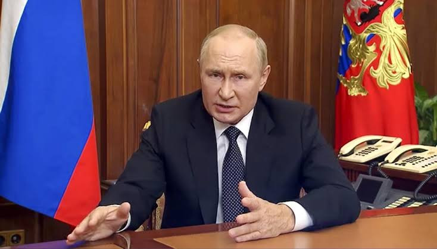

# Putin ameaça Ucrânia

 

---

 # **Ameaça nuclear feita pelo presidente russo, Vladimir Putin**
em discurso à nação nesta quarta-feira (21/09), foram recebidas com fortes críticas no Ocidente e vistas como um ato de desespero do chefe de governo em Moscou.

# **Ocidente condena ameaça nuclear de Putin**

Líderes veem ato de desespero do líder russo e sinal de fracasso de seus planos na Ucrânia. Retórica "perigosa e irresponsável" deve deixar a Rússia ainda mais isolada, 

---

# **"Mundo não permitirá", diz Zelenski**

O presidente ucraniano, Volodimir Zelenski, disse achar improvável que Putin faça uso de seu arsenal nuclear, mas ressaltou que a ameaça ressalta a importância de fazer frente ao líder do Kremlin. "Não acredito que ele vá usar essas armas. Não acho que o mundo permitirá que ele as utilize", disse Zelenski.

Mykhailo Podolyak, conselheiro de Zelenski, classificou a fala de Putin como "um apelo absolutamente previsível, que mais parece uma tentativa de justificar seu próprio fracasso".
